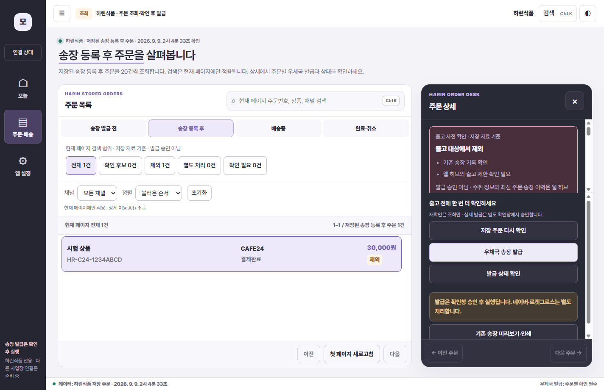
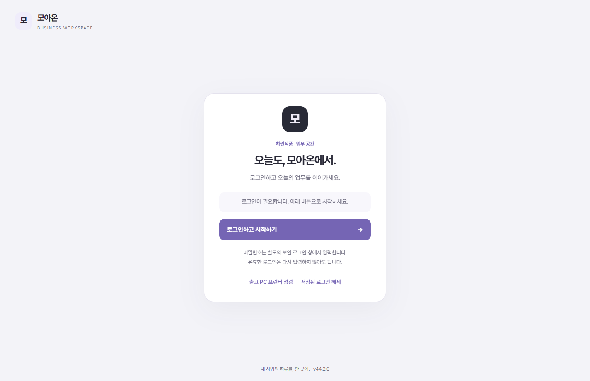

# P4-29 — Studio V3 실제 UI 적용과 Pretendard / 0.18.0

2026-09-09. 앱 디자인 시안 적용, 로그인 톤 통일, Pretendard 요청을 함께 반영했다. Windows 앱 업데이트이며 웹 운영 배포나 API/DB 변경은 없다.

## 사용자가 볼 수 있는 변화

- 슬림한 왼쪽 메뉴, 밝은 주문 목록, 짙은 주문 상세 패널, 차분한 아이리스 보라색으로 시안의 시각 체계를 적용했다. 다크 테마도 함께 지원한다.
- 기존 오늘·주문/배송·앱 설정과 검색·필터·정렬·상태별 조회·페이지 이동·주문 확인·발급·라벨 동선을 유지했다. 사업장 연결 정보는 왼쪽 `연결 상태`를 열어 확인한다.
- 앱 진입 화면과 별도 보안 로그인창의 색상·모서리·간격을 맞췄다. 비밀번호 검증·로그인 유지·만료 처리 로직은 바꾸지 않았다.
- Pretendard Variable을 앱에 포함했다. 본문 400, 버튼 600, 제목 650~700, 금액 700을 사용한다. 100~900 굵기를 지원하지만 업무 가독성을 위해 본문에는 아주 얇은 굵기를 쓰지 않았다.
- 화면 진입 160ms, 상세 180ms, 버튼 색상 전환 140ms의 짧은 효과를 적용했다. 움직임 줄이기 설정에서는 끈다.
- 작은 창에서는 상태 탭·검색 영역을 압축하고 목록/상세/작업 영역을 스크롤할 수 있게 했다. 기능을 삭제해서 공간을 확보하지 않았다.

## 폰트와 보안

이 PC에 설치된 수정하지 않은 PretendardVariable.ttf를 앱에 포함했다. 공식 OFL 라이선스를 함께 넣었으며 런타임에 외부 폰트 서버를 기다리지 않는다. [공식 라이선스](https://github.com/orioncactus/pretendard/blob/main/LICENSE)

앱 자체 화면은 다른 PC에 Pretendard가 없어도 포함 파일을 사용한다. 별도 원격 보안 로그인창은 현재 PC의 설치 폰트를 우선하고, 없는 PC에서는 맑은 고딕으로 대체한다. 원격 인증 페이지에 임의 파일 접근 권한을 열지는 않았다.

전용 리소스 허용 목록에는 정확한 CSS/폰트 경로만 추가했다. 기존 주문 API·사업장 경계·발급 확인창·중복 실행 방지·라벨 보안은 유지한다.

## 검증 결과

| 구분 | 결과 |
|---|---|
| 단위 시험 | 124 통과, 실패/건너뜀 0 |
| 격리 주문 도구 | 폰트 실제 로드, 채널/정렬/미확인 금액/단축키/초기화/라이트·다크 통과 |
| 격리 로그인 | 우선 표시·취소·정상 세션·만료·비밀번호 입력창 유지 통과 |
| 격리 출고/라벨 | 모의 API·확인창·이력·목록 이동·미리보기·로그아웃 정리 통과 |
| 패키징 | NSIS 빌드 종료 0 |
| 이 PC 설치 | 설치 종료 0, 실제 EXE v0.18.0 확인 |
| 실제 재시작 | 기존 프로필/다크 테마/저장 로그인 유지 확인 |
| 실제 저장 주문 | ACTIVE 1, REGISTER 0, IN_TRANSIT 2, COMPLETED 87 조회 READY; 완료 목록 20개씩 다음/이전 확인 |

격리 테스트는 개발 Electron 런타임에서 패키지 콘텐츠를 읽고 가명 API를 사용한다. 실제 설치 EXE 시험은 기존 저장 로그인으로 읽기만 했다. 실제 송장 발급/실제 인쇄/새 비밀번호 입력은 실행하지 않았다.

재시작 측정: 로컬 UI 520~1048ms. 업무 화면 진입은 2.7~24.6초로 편차가 있다. 첫 두 번 사업장 1개 조회 성공 후 추가 재시작에서 사업장 목록 실패가 다시 발생했다. 주문 조회 성공을 서버 안정성 해결로 표시하지 않는다.

## 설치 파일

- 파일: desktop/dist/Moaon-Preview-0.18.0-Setup.exe
- 크기: 113,546,001 bytes
- SHA256: B7555B2D134A6278165D1497B57B77A8A84E700C815D3A25205122537FC1115F
- 서명: NotSigned. Windows 경고 가능. 서명 인증서 구매는 하지 않았다.
- 설치 위치: C:\Users\a\AppData\Local\Programs\Moaon Preview\MoaonPreview.exe

## 화면 기록

아래는 가명 자료 테스트 화면이다. 실제 고객 자료가 아니며, 개발 런타임의 버전 표시는 설치 앱 버전과 다를 수 있다.

## 다음 개발

1. 사업장 목록 간헐 실패와 25초 진입의 서버 요청 구간·타임아웃·DB 연결 원인을 추적하고 수정한다. 한국 IP 구매를 원인 확인 없이 대안으로 확정하지 않는다.
2. 출고 PC에서 실제 프린터/용지 프로필을 확인하고 승인된 소량 출력 인수를 진행한다. 기존 송장 재출력과 새 발급을 구분한다.
3. 이후 기존 웹 업무의 앱 이전을 업무 묶음 단위로 계속한다. 시안에만 있는 메뉴·작업 로그를 동작하는 기능처럼 추가하지 않는다.

이번 단계는 UI/폰트 실제 설치까지이며, 다사업장 외부 개방·전체 웹 메뉴 이전·실제 프린터 종단간 인수 완료를 뜻하지 않는다.
